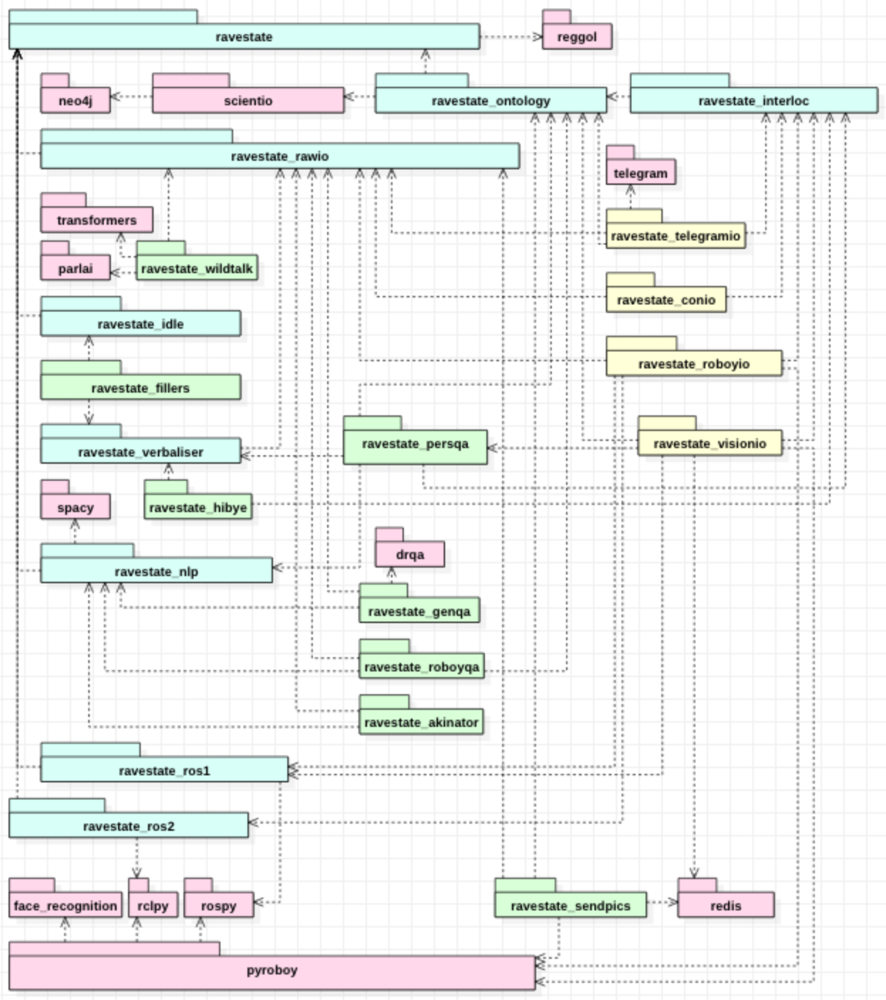

[](https://github.com/ro-boy/ravestate)
[](https://travis-ci.org/Roboy/ravestate)
[](https://codecov.io/gh/Roboy/ravestate)

## About

```
   ____                          __      __        _____       _____   
  / _  \____  __  ______  ______/ /_____/ /___    /_   _\     /_   _\  
 / /_/ / __ \/ / / / __ \/ ___\, / __ \, / __ \    0>  0>     <0  <0   
/ ,\ ,/ /_/ /\ \/ / /_/ /\__, / / /_/ / / /_/ /   \__⊽__/     \__⊽__/  
\/  \/\__/\/  \__/ ,___/\____/\/\__/\/\/ ,___/       ⋂  - Hey!   ⋂     
                 \____/                \____/             Olà! -       
```

Ravestate is a reactive library for real-time natural language dialog systems. It combines elements from event-based and reactive programming into an API, where application states are defined as functions that are run when a certain boolean set of criteria (signals) in the current application context is satisfied. It is the first reactive API to allow for boolean combinations of events.

### Reactive Hello World

```python
from ravestate.context import startup, Context
from ravestate.state import state
from ravestate.module import Module

# We want to write some text output, so we
# need the raw:out context property from ravestate_rawio.
from ravestate_rawio import output as raw_out

# Make sure that we use some i/o implementation,
# so we can actually see stuff that is written to rawio:out.
import ravestate_conio

# Ravestate applications should always be wrapped in a Module.
# This allows easier scoping, and enables separation of concerns
# beyond states.
with Module(name="hi!"):

    # Create an application state which reacts to the `:startup` signal,
    # and writes a string to raw:out. Note: State functions are
    # always run asynchronously!
    @state(cond=startup(min_age=3.), write=raw_out.id())
    def hello_world(context):
        context[raw_out.id()] = "Waddup waddup waddup!"

# Run context with console input/output and our 'hi!' module.
Context("conio", "hi!").run()
```

## Installation

### Via PIP

The easiest way to install ravestate is through pip:

``
pip install ravestate
``

__Note:__ Ravestate requires Python 3.6 or higher. It is tested
on Ubuntu 16.04 and 18.04, as well as macOS > High Sierra.
It is currently not tested on Windows.

For reliability, we recommend using an environment virtualization tool,
like [virtualenv](https://virtualenv.pypa.io/en/latest/)
or [conda](https://conda.io/en/latest/).

### For developers

First, install dependencies:

```bash
pip install -r requirements.txt

# To run tests, install pytest, mocking, fixtures...
pip install -r requirements-dev.txt
```

Then, you may open the repository in any IDE, and mark the
`modules` folder as a sources root. Alternatively for development
purposes, call `export PYTHONPATH=$PYTHONPATH:$(pwd)/modules` from
your ravestate clone, to tell python that there are modules
to be loaded in the `modules` directory (the IDE does this for you).

## Running Hello World

Ravestate applications are defined by a configuration,
which specifies the ravestate modules that should be loaded.

To run the basic hello world application, run ravestate
with a config file or command line arguments:

### Running with command line spec

You can easily run a combination of ravestate modules in a shared context,
by listing them as arguments to the `rasta` command, which is installed
with ravestate:

```bash
python3 -m ravestate \
    ravestate_wildtalk \
    ravestate_conio \
    ravestate_hibye \
    ravestate_akinator
```
Run `python3 -m ravestate -h` to see more options!

### Running with config file(s) 

You may specify a series of config files to configure ravestate context,
when specifying everything through the command line becomes too laborious:

```yaml
# In file hello_world.yml
module: core
config:
  import:
    - ravestate_wildtalk
    - ravestate_conio
    - ravestate_hibye
    - ravestate_akinator
```
Then, run `ravestate` with this config file:

```bash
python3 -m ravestate -f hello_world.yml
```

## Module overview

Ravestate offers a landscape of fine-grained modules
for different aspects of dialog application tasks, which
may be seen in the following dependency diagram. Broadly,
the modules are categorized into Core (Blue), I/O (Yellow),
External (Red) and Skills (Green):



#### Core Modules

  
  | Module name          | Description |
  |----------------------|-------------|
  | ravestate            | Core ravestate library.
  | ravestate_rawio      | Provides `raw_in`, `raw_out`, `pic_in` properties, which are served by the IO modules.
  | ravestate_ontology   | Connects to [scientio](https://github.com/roboy/scientio) to serve a built-in ontology.
  | ravestate_interloc   | Provides the `all_interlocutors` property, where present interlocutors are registered by the IO modules.
  | ravestate_idle       | Provides `bored` and `impatient` signals, as specified [here](https://github.com/Roboy/ravestate/issues/12_).
  | ravestate_verbaliser | Utilities for easy management of conversational text, documented [here](modules/ravestate_verbaliser/README.md).
  | ravestate_nlp        | Spacy-based NLP properties and signals, documented [here](modules/ravestate_nlp/README.md).
  | ravestate_ros2       | Provides specific `Ros2PubProperty`, `Ros2SubProperty` and `Ros2CallProperty` context props., which greatly simplify working with ROS2 in ravestate.


#### IO Modules

  | Module name          | Description |
  |----------------------|-------------|
  | ravestate_conio      | Simple command-line based IO for development purposes.
  | ravestate_telegramio | Single- or Multi-process Telegram server module, documented [here](modules/ravestate_telegramio/README.md). 
  | ravestate_roboyio    | [PyroBoy](https://github.com/roboy/pyroboy) -based STT/TTS with ROS2.


#### Skill Modules

  | Module name          | Description |
  |----------------------|-------------|
  | ravestate_wildtalk   | [ParlAI](https://github.com/roboy/parlai) -based generative conversational module. 
  | ravestate_hibye      | Simply voices __Hi!__ (or the likes thereof) when an interlocutor is added, and __Bye__ when one is removed.
  | ravestate_genqa      | [DrQA](https://github.com/roboy/drqa) -based general question answering module.
  | ravestate_roboyqa    | QA module which provides answers to questions about Roboy, such as __Who is your dad?__
  | ravestate_akinator   | Enables dialog-based play of [Akinator!](modules/ravestate_akinator/README.md)
  | ravestate_sendpics   | Uses face recognition to extract facial features and an assiciated Person with `pic_in` and ontology, which are then persisted in Redis and Scientio.
  | ravestate_stalker    | Uses `facial feature <-> person` tuples generated by sendpics, to surprise people in front of a camera with knowledge of their names.


## Running tests

If you have installed the dependencies from ``requirements-dev.txt`` you
may run the ravestate test suite as follows:

``
./run_tests.sh
``

## Building/maintaining the docs

If you have installed the dependencies from ``requirements-dev.txt``,
generate the docs by running this command at project root:

```bash
export PYTHONPATH=$PYTHONPATH:$(pwd)/modules
git rm -rf docs
rm -rf _build docs
pydocmd build
mkdir -p docs/resources/docs && cp resources/docs/*.png docs/resources/docs
git add docs/*
# For inspection: python3 -m http.server --directory docs
```

The structure and content of the docs are defined in the file ``pydocmd.yml``.
