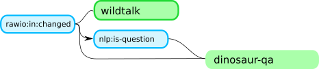
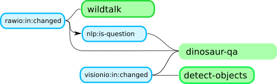
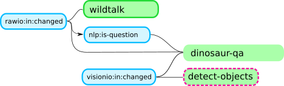
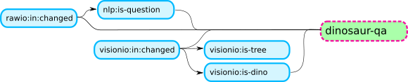

## Example for Ravestate UI event message sequence

### Message schema

#### Spike updates

| Field name   | Value domain           | Purpose                                                |
|--------------|------------------------|--------------------------------------------------------|
| `type`       | `"spike"`              | Message type - identifies message schema.              |
| `id`         | `int`                  | Identifies a unique spike  - use to update view model. |
| `signal`     | `str`                  | Signal represented by spike - use as caption.          |
| `parents`    | `List[int]`            | List of immediate parent spikes that caused this spike - draw connections pointing from parents to child spikes. |


#### Activation updates

| Field name   | Value domain           | Purpose                                                |
|--------------|------------------------|--------------------------------------------------------|
| `type`       | `"activation"`         | Message type - identifies message schema.    |
| `id`         | `int`                  | Identifies a unique activation  - use to update view model. |
| `state`      | `str`                  | State represented by activation - use as caption.      |
| `specificity` | `float`               | Specificity of state - visualise proportionally as relevance |
| `status`     | `{"wait", "ready", "run"}` | Status of activation. __Explanation__: `"wait"`: Activation is waiting for additional spikes. `"ready"`: Activation is waiting for permission to run. `"run"`: Activation is executing. |
| `spikes`     | `List[Dict[str, int]]` | Every dict represents a disjunct conjunction of signal spike references as a map from `signal name` to `spike id`. A spike id of `-1` indicates, that no spike for the given signal name is referenced yet. An activation should only be displayed, if it references at least one spike. Visualise referenced spikes as lines from the activation to the spike. |

⚠️ Do not confuse `state` and `status`!

#### Output message

This message is sent to the frontend, when output is received (`raw:out` property value changes):


#### Input message

This message us sent from the frontend to the backend, when the user types dialog input. The backend writes the


### Sample message sequence

#### Message 0: A spike (id 0) is instantiated

```json
{
    "type": "spike",
    "signal": "rawio:in:changed",
    "id": 0,
    "parents": []
}
```

#### Messages 1-3: Activations are introduced which reference the new spike

```json
{
    "type": "activation",
    "id": 0,
    "state": "wildtalk",
    "specificity": 0.2,
    "status": "ready",
    "spikes": [{
        "rawio:in:changed": 0
    }]
}
{
    "type": "activation",
    "id": 1,
    "state": "nlp",
    "status": "ready",
    "specificity": 0.2,
    "spikes": [{
        "rawio:in:changed": 0
    }]
}
{
    "type": "activation",
    "id": 2,
    "state": "dinosaur-qa",
    "status": "wait",
    "specificity": 1.2,
    "spikes": [{
        "rawio:in:changed": 0,
        "nlp:is-question": -1,
        "visonio:is-dino": -1,
        "visonio:in:changed": -1
    }]
}
```

#### Spike-Activation view after message 3


#### Message 4: NLP state activation runs

```json
{
    "type": "activation",
    "id": 1,
    "state": "nlp",
    "specificity": 0.2,
    "status": "run",
    "spikes": [{
        "rawio:in:changed": 0
    }]
}
```

#### Spike-activation view after message 4


#### Message 5: NLP activation dereferences spikes

```json
{
    "type": "activation",
    "id": 1,
    "state": "nlp",
    "status": "ready",
    "specificity": 0.2,
    "spikes": [{
        "rawio:in:changed": -1
    }]
}
```

#### Message 6: `nlp:is-question` spike

```json
{
    "type": "spike",
    "signal": "nlp:is-question",
    "id": 1,
    "parents": [0]
}
```

#### Message 7: `dinosaur-qa` refs. `nlp:is-question`

```json
{
    "type": "activation",
    "id": 2,
    "state": "dinosaur-qa",
    "status": "wait",
    "specificity": 1.2,
    "spikes": [{
        "rawio:in:changed": 0,
        "nlp:is-question": 1,
        "visonio:is-dino": -1,
        "visonio:in:changed": -1
    }]
}
```

#### Spike-activation view after message 7 



#### Message 8: `visionio:in:changed` spike

```json
{
    "type": "spike",
    "signal": "visionio:in:changed",
    "id": 2,
    "parents": []
}
```

#### Message 9-10: `detect-objects`, `dinosaur-qa` ref. new spike

```json
{
    "type": "activation",
    "id": 2,
    "state": "dinosaur-qa",
    "status": "wait",
    "specificity": 1.2,
    "spikes": [{
        "rawio:in:changed": 0,
        "nlp:is-question": 1,
        "visonio:is-dino": -1,
        "visonio:in:changed": 2
    }]
}
{
    "type": "activation",
    "id": 3,
    "state": "detect-objects",
    "status": "ready",
    "specificity": 1.2,
    "spikes": [{
        "visonio:in:changed": 2
    }]
}
```

#### Spike-activation view after message 10



#### Message 11: `detect-objects` runs

```json
{
    "type": "activation",
    "id": 3,
    "state": "detect-objects",
    "status": "run",
    "specificity": 1.2,
    "spikes": [{
        "visonio:in:changed": 2
    }]
}
```

#### Spike-activation view after message 11



#### Message 12: `detect-objects` derefs. spikes

```json
{
    "type": "activation",
    "id": 3,
    "state": "detect-objects",
    "status": "run",
    "specificity": 1.2,
    "spikes": [{
        "visonio:in:changed": -1
    }]
}
```

#### Message 13-14: Follow-up spikes from `visionio:in:changed`

```json
{
    "type": "spike",
    "signal": "visionio:is-tree",
    "id": 3,
    "parents": [2]
}
{
    "type": "spike",
    "signal": "visionio:is-dino",
    "id": 4,
    "parents": [2]
}
```

#### Message 15: `dinosaur-qa` refs. another spike

```json
{
    "type": "activation",
    "id": 2,
    "state": "dinosaur-qa",
    "status": "ready",
    "specificity": 1.2,
    "spikes": [{
        "rawio:in:changed": 0,
        "nlp:is-question": 1,
        "visonio:is-dino": 4,
        "visonio:in:changed": 2
    }]
}
```

#### Spike-activation view after message 15


#### Message 16-17: `dinosaur-qa` is run, `wildtalk` derefs.

```json
{
    "type": "activation",
    "id": 0,
    "state": "wildtalk",
    "specificity": 0.2,
    "status": "ready",
    "spikes": [{
        "rawio:in:changed": -1
    }]
}
{
    "type": "activation",
    "id": 2,
    "state": "dinosaur-qa",
    "status": "run",
    "specificity": 1.2,
    "spikes": [{
        "rawio:in:changed": 0,
        "nlp:is-question": 1,
        "visonio:is-dino": 4,
        "visonio:in:changed": 2
    }]
}
```

#### Spike-activation view after message 17




