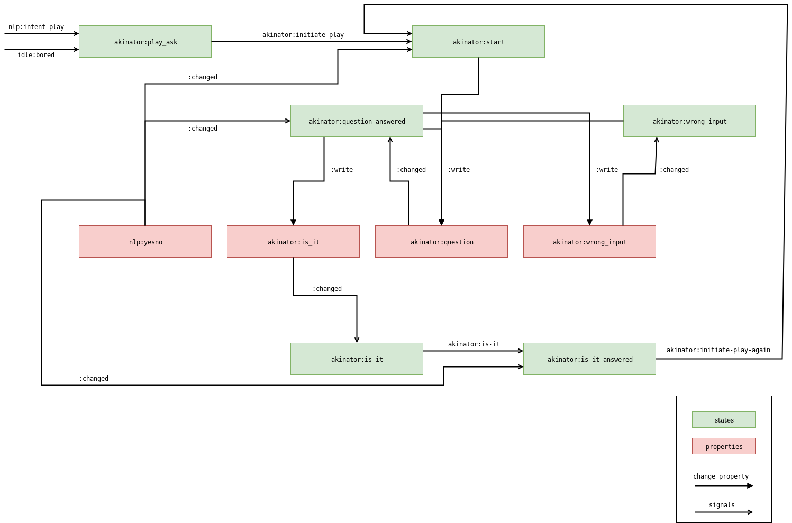

```
       _     _                              
      | |   (_)              _              
 _____| |  _ _ ____  _____ _| |_ ___   ____ 
(____ | |_/ ) |  _ \(____ (_   _) _ \ / ___)
/ ___ |  _ (| | | | / ___ | | || |_| | |    
\_____|_| \_)_|_| |_\_____|  \__)___/|_|    
                                                                       
```

## 20 Questions with Akinator

The Ravestate Akinator module offers an implementation of the 20 questions game.
It consists of a wrapper for the [API calls](api.py) to the [Akinator](https://en.akinator.com/) web game and 
several [states](__init__.py) to handle the game flow with the interlocutor.

### Architecture
This is an overview of the dialog flow for the 20 questions game. 



### Starting the Game
There are two possibilities to trigger the game:
1. Interlocutor input: "I want to play", "I like games" or something similar
2. Automatically through Ravestate: When the system gets bored (no dialog states are active but an interlocutor is present) 
then Akinator is one of the possible modules that will be triggered. 

### The API Wrapper
[api.py](api.py) handles the requests to the online Akinator game.
There are three different types of get requests to handle the game: 
1. Question asking phase: post the answer to the previous question and retrieve the next question
2. Guessing phase: retrieve the guess
3. Game finishing phase: give Akinator feedback on his guess
