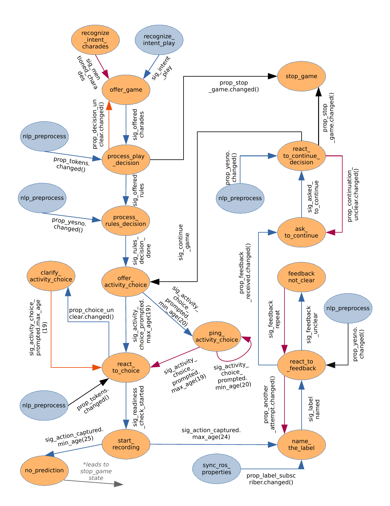
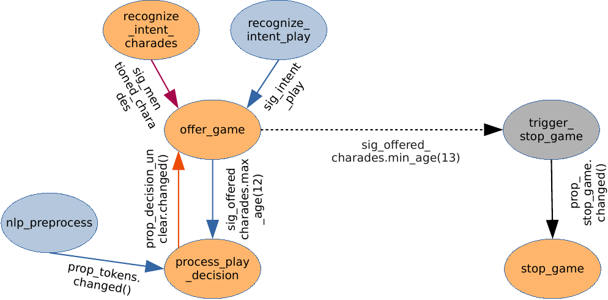

# Charades

Charades is a game based on human activity recognition. The idea is that you can show an action to Roboy and he tries to guess it.
It assumes an access to camera, since guessing happens based on the visual input. 

# Installation

Charades module (besides this dialog implementation) requires an action recognition pipeline that does the actual classification. Ravestate_charades module communicates with it using ROS.
Action recognition also requires GPU and because of the many dependencies is shipped as a docker container.
Full installation can be found [here](https://github.com/mfedoseeva/roboy-activity-recognition).

# States  

The charades module consists of 14 states controlling the game flow + 3 general states that are responsible for stopping the current game session and restoring the state of the game and its global properties to the default condition, as well as for detecting a situation when playing charades should be suggested.  

The game flow can be depicted as follows:  

   

The above diagram omits a certain detail of the implementation, namely, that when a state (state A) is conditioned on user input and a signal, the signal will be constrained with a maximum age. At the same there is a designated state (state B) that waits for the old signals and if activated, will lead to stopping the current game session. State A and state B are set to be mutually exclusive, so either a signal activates state A in the assigned maximum time, or if it gets older than the max time, state B is activated and game ends. Mutual exclusivness is achieved by making the two states write to the same property (check properties with suffix 'mutex' in code).   

This is done to avoid situations, when user input was not provided in the lifetime of the signal and the game flow is stuck. This logic is illustrated on the following diagram:

  

In this case a particular instance of a signal sig_offered_charades can activate either an offer_game or a  trigger_stop_game state.  