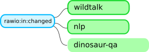
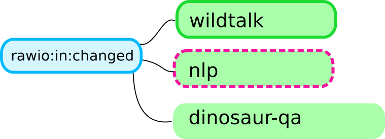
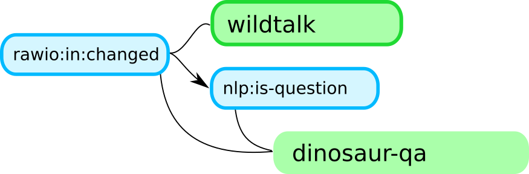
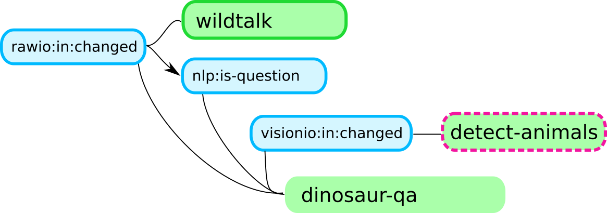
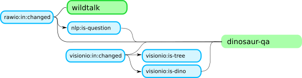
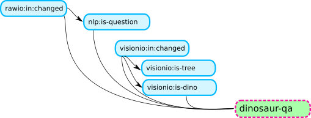

## Example for Ravestate UI event message sequence

```json
{
    "type": "spike",
    "signal": "rawio:in:changed",
    "id": 0,
    "parents": [],
}
```
```json
{
    "type": "activation",
    "id": 0,
    "state": "wildtalk",
    "specificity": 0.2,
    "parents": [],
    "constraints": [{
        "rawio:in:changed": 0
    }]
}
```













